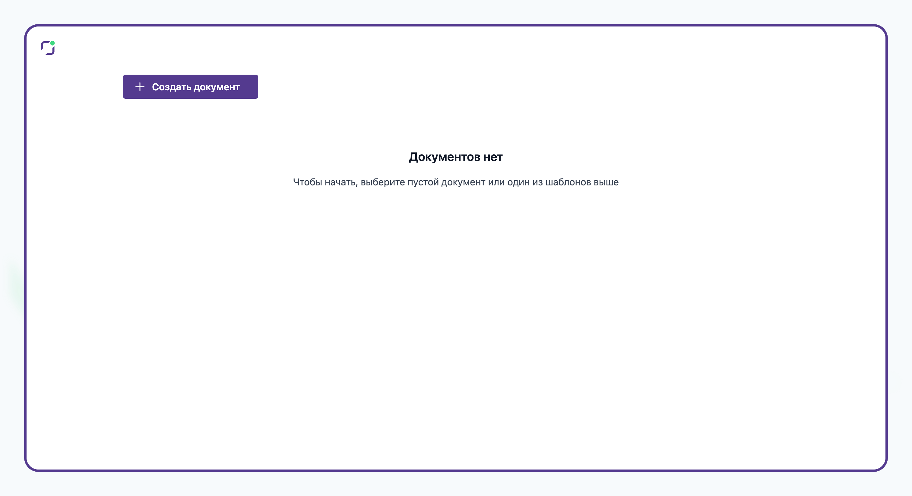
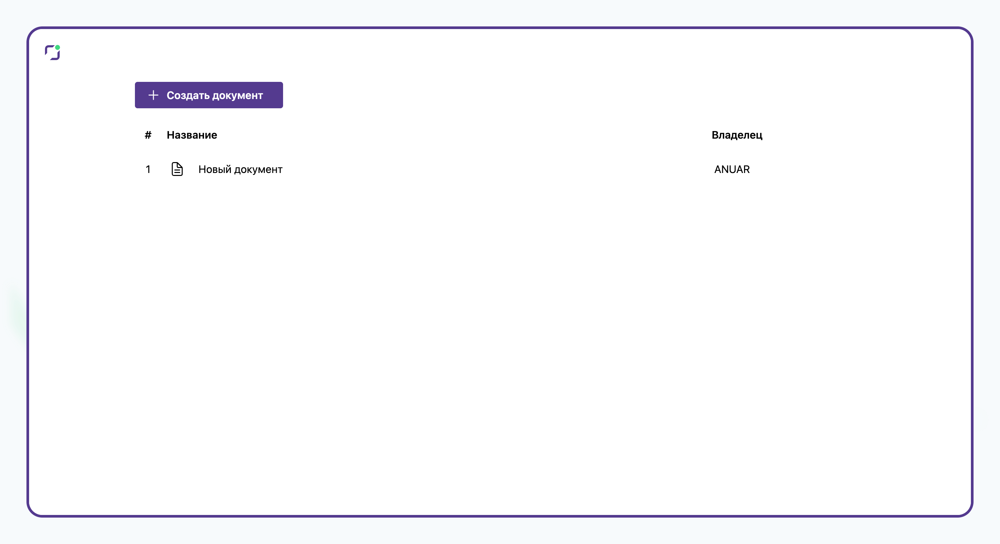
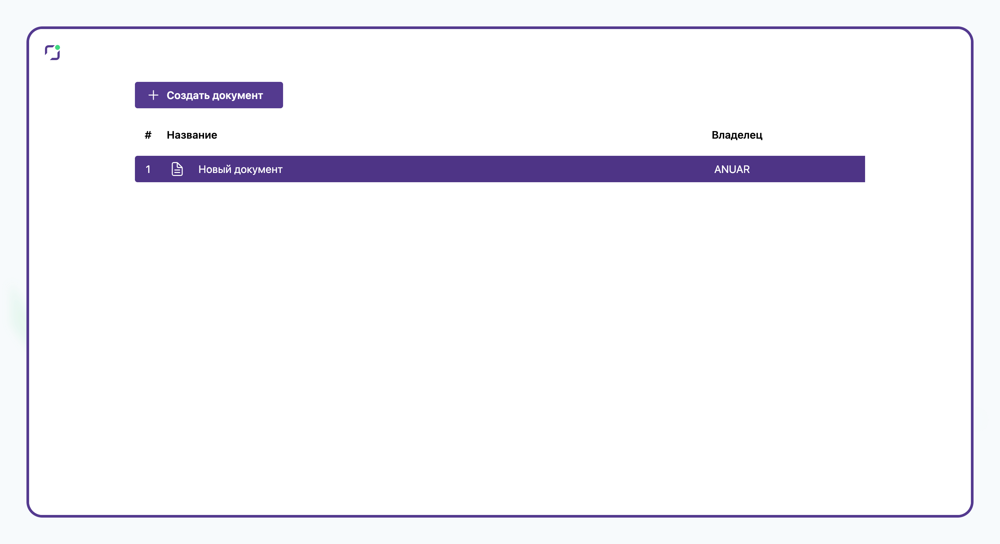
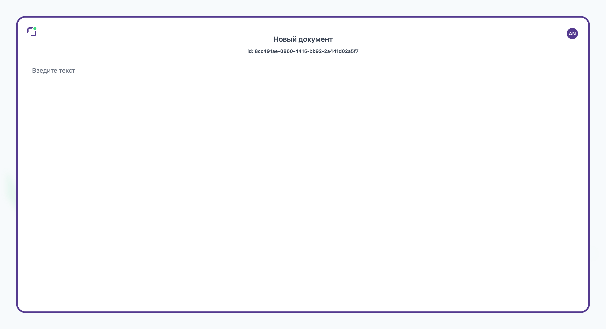

## zimdoc

## Что собой представляет?

- Монорепозиторий который содержит код для frontend и backend приложения
- Содержит отдельными пакетами конфигурацию eslint/eslint-ts

### Функционал

Приложения для работы с документами.

- идентификация пользователя
- возможность создавать новые документы
- совместное редактирование
- отдельное редактирование каждого документа

**Страница авторизации**


**Главная страница**





**Страница документа**



### Как запустить?

```
npm run dev
```

URL - http://localhost:5173
